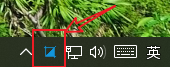
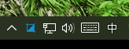
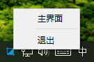
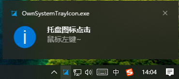

# OwnSystemTrayIcon

一个客户端程序, 有时候会需要提供退出到最小化托盘的功能, Qt 的 `QSystemTrayIcon` 类就刚好实现了这个功能, 这篇文章主要就是对它简单封装一下,实现一些额外的功能 <!--more-->

## 功能点

- 最小化到托盘
- 例如微信收到消息, 托盘状态下闪烁
- 托盘下菜单功能
- 托盘下鼠标事件的响应

如果单独提一个功能比较麻烦,先看一下简单封装后的 `OwnSyetemTrayIcon` 的头文件

```C++
class QMenu;
class QTimer;

class OwnSyetemTrayIcon : public QSystemTrayIcon
{
    Q_OBJECT

public:
    OwnSyetemTrayIcon();
    ~OwnSyetemTrayIcon();

    // 托盘闪烁的控制
    void startTrayFlash();
    void stopTrayFlash();

private slots:
    // 托盘下鼠标事件的响应的处理
    void slotActivated(QSystemTrayIcon::ActivationReason reason);

signals:
    // 托盘下菜单点击信号
    void sigNormalShow();
    void sigClose();

private:
    // 托盘闪烁的实际实现
    void iconFlash();

private:
    // 托盘下菜单对象
    QMenu *m_menu;
    // 控制闪烁的定时器
    QTimer *m_flashTimer;
    // 决定是闪还是烁
    bool m_flashStatus;
};
```

## 最小化到托盘



因为是继承自 `QSystemTrayIcon` , 所以如果只要最小化到托盘只要简单的设置托盘状态下的图标即可

```C++
this->setIcon(QIcon(":/Icon/logo.ico"));
```

调用的时候也只需要实例化后，`show()` 即可

```C++
OwnSyetemTrayIcon *m_trayIcon = new OwnSyetemTrayIcon;
m_trayIcon->show();
```

## 托盘状态下闪烁



闪烁其实逻辑很简单，托盘的图标一会儿有样式一会儿没有样式，代码如下：

```C++
connect(m_flashTimer, &QTimer::timeout,this,&OwnSyetemTrayIcon::iconFlash);

// 开始闪烁，就是启动定时器
void OwnSyetemTrayIcon::startTrayFlash()
{
    if (m_flashTimer && m_flashTimer->isActive())
        return;

    m_flashTimer->start(500);
}

// 停止闪烁，就是停止定时器，并设置可见的图标
void OwnSyetemTrayIcon::stopTrayFlash()
{
    if (m_flashTimer && m_flashTimer->isActive())
        m_flashTimer->stop();

    if (m_flashStatus)
        this->setIcon(QIcon(":/Icon/logo.ico"));
}

// 闪烁的时候设置的资源文件中存在的图标文件，相反则随便写一个找不到图标既可
void OwnSyetemTrayIcon::iconFlash()
{
    if (m_flashStatus)
        this->setIcon(QIcon(":/Icon/logo.ico"));
    else
        this->setIcon(QIcon(":/Icon/no_logo.ico"));

    m_flashStatus = !m_flashStatus;
}
```

`m_flashStatus` 变量控制样式，`m_flashTimer` 定时器来启动闪烁

## 托盘下菜单功能



```C++
connect(m_menu->addAction(QIcon(), CN("主界面")), &QAction::triggered, this, &OwnSyetemTrayIcon::sigNormalShow);
m_menu->addSeparator();
connect(m_menu->addAction(QIcon(), CN("退出")), &QAction::triggered, this, &OwnSyetemTrayIcon::sigClose);
this->setContextMenu(m_menu);
```

这里的 `CN("主界面")` 其实一个宏，因为经常出现中文乱码的问题，而且也不想通过 "工具" -> "选项" —> "文本编辑器"("行为") 里修改文件编码

```C++
#ifdef __GNUC__
#define CN(ch)          QString::fromLocal8Bit(ch)
#else
#define CN(ch)          QStringLiteral(ch)
#endif
```

因为我一般只用 `MINGW` 或者 `MSVC` 这 2 种编译器，一般情况下也不考虑翻译的问题

- `MINGW` 下一般都是使用 `QString::fromLocal8Bit`
- `MSVC` 则使用 `QStringLiteral`, 简单区分了一下

## 托盘下鼠标事件的响应

通过信号槽绑定 `void activated(QSystemTrayIcon::ActivationReason reason);` 信号就能很简单实现这个功能

其中 `QSystemTrayIcon::ActivationReason` 枚举如下，够用了

```C++
enum ActivationReason {
    Unknown,
    Context,
    DoubleClick,
    Trigger,
    MiddleClick
};
```

简单看一下代码：

```C++
connect(this,&QSystemTrayIcon::activated,this,&OwnSyetemTrayIcon::slotActivated);

void OwnSyetemTrayIcon::slotActivated(QSystemTrayIcon::ActivationReason reason)
{
    switch (reason)
    {
    case QSystemTrayIcon::Trigger:
        this->showMessage(CN("托盘图标点击"),CN("鼠标左键~"));
        emit sigNormalShow();
        break;
    default:
        break;
    }
}
```

调用自带的 `showMessage()` 系统弹窗的格式大概如下：



## 调试一下

```C++
// 初始化
void MainWindow::initTrayIcon()
{
    // OwnSyetemTrayIcon *m_trayIcon; 头文件中声明了
    if (!m_trayIcon) 
        m_trayIcon = new OwnSyetemTrayIcon;

    connect(m_trayIcon, &OwnSyetemTrayIcon::sigNormalShow, 
            this, [this]{this->show();this->m_trayIcon->stopTrayFlash();});

    connect(m_trayIcon, &OwnSyetemTrayIcon::sigClose,
             this, [this]{ this->m_realClose=true;this->close();});
    m_trayIcon->show();
}


void MainWindow::closeEvent(QCloseEvent *e)
{
    // m_realClose 区分状态栏点击的退出和主界面下的退出
    if (m_realClose) {
        e->accept();
        return;
    }

    QMessageBox msgbox;
    msgbox.setWindowTitle(CN("关闭提示"));
    msgbox.setText(CN("您点击了关闭按钮，您是想："));
    msgbox.addButton(QMessageBox::Yes)->setText(CN("最小化到托盘"));
    msgbox.addButton(QMessageBox::No)->setText(CN("退出程序"));

    if (msgbox.exec() == QMessageBox::No) {
        e->accept();
    } else {
        e->ignore();
        m_trayIcon->show();
        this->hide();
        // 模拟一下收到消息后通知托盘闪烁
        QTimer::singleShot(1000, m_trayIcon, &OwnSyetemTrayIcon::startTrayFlash);
    }
}
```

使用过程中其实也要根据实际情况，托盘和菜单栏是否同时存在，这就是涉及到 `this->hide()` 或者托盘什么时候就显示，当然这些都是小问题

## 完整代码地址

我使用的版本和编译环境：

- `Qt 5.7.1`
- 编译器使用的是 `MINGW 5.3.0 32bit` 也就是默认自带的

<https://github.com/catcheroftime/OwnSystemTrayIcon>
